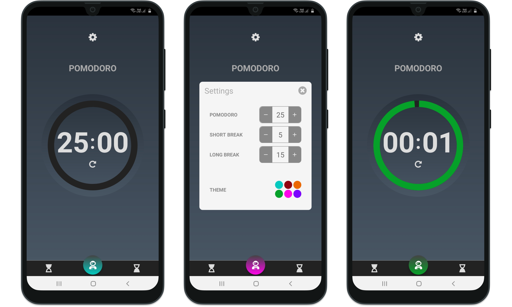

## Sobre a Técnica de Pomodoro

É um método de gerenciamento de tempo desenvolvido por Francesco Cirillo no final dos anos 1980. Consiste na utilização de um cronômetro para dividir o trabalho em períodos definidos (normalmente de 25 minutos) separados por breves intervalos.

## Tecs:

O APP está sendo desenvolvido em Javascript, utilizando  React Native

## [APK - Current Build](https://exp-shell-app-assets.s3.us-west-1.amazonaws.com/android/%40ummatias/Pomodoro-acf5849e4a1f4b2ca702ebb629b51167-signed.apk)

### Image Rights
[Sky vector created by freepik - www.freepik.com](https://www.freepik.com/vectors/sky')

[Astronaut on Logo - Designed by Freepik](http://www.freepik.com)
